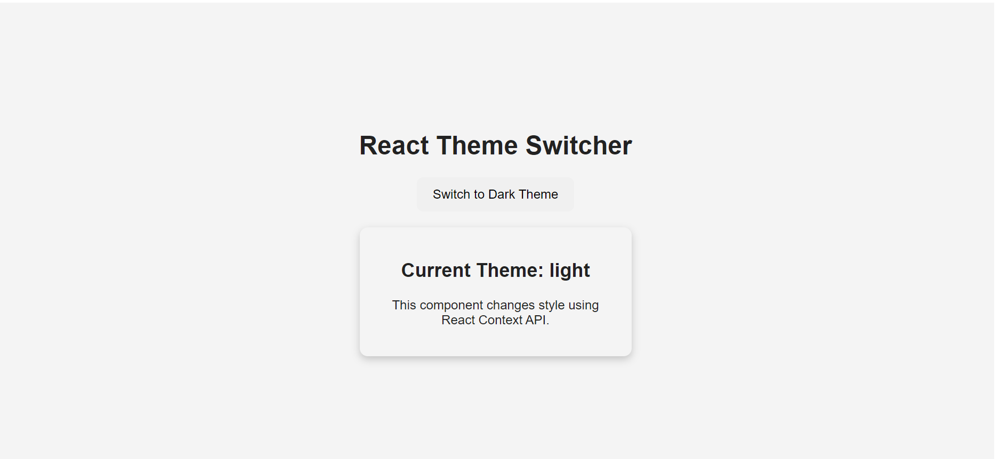
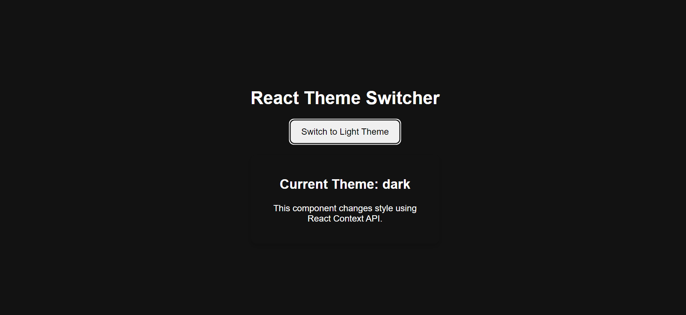

# React + Vite

This template provides a minimal setup to get React working in Vite with HMR and some ESLint rules.

Currently, two official plugins are available:

- [@vitejs/plugin-react](https://github.com/vitejs/vite-plugin-react/blob/main/packages/plugin-react) uses [Oxc](https://oxc.rs)
- [@vitejs/plugin-react-swc](https://github.com/vitejs/vite-plugin-react/blob/main/packages/plugin-react-swc) uses [SWC](https://swc.rs/)

## React Compiler

The React Compiler is not enabled on this template because of its impact on dev & build performances. To add it, see [this documentation](https://react.dev/learn/react-compiler/installation).

## Expanding the ESLint configuration

If you are developing a production application, we recommend using TypeScript with type-aware lint rules enabled. Check out the [TS template](https://github.com/vitejs/vite/tree/main/packages/create-vite/template-react-ts) for information on how to integrate TypeScript and [`typescript-eslint`](https://typescript-eslint.io) in your project.
============================================================================================================


# 🌗 Theme Toggle System Using React.js

A modern **Theme Toggle Application** built using **React.js and Context API** that enables users to switch between **Light Mode and Dark Mode** dynamically.

This project demonstrates the practical implementation of **React Context API**, state management, reusable components, and global theme handling across the application.

---

## 🚀 Features

* 🌞 Light Mode Theme
* 🌙 Dark Mode Theme
* 🔄 Dynamic theme switching
* ⚛️ React Context API implementation
* 🎯 Global theme state management
* 🎨 CSS-based theme customization
* 💾 Easy integration with Local Storage
* 📱 Responsive user interface

---

## 🛠️ Tech Stack

| Technology        | Usage                         |
| ----------------- | ----------------------------- |
| React.js          | Frontend library              |
| JavaScript (ES6+) | Application logic             |
| Context API       | Global theme state management |
| HTML5             | Application structure         |
| CSS3              | Styling and theme design      |
| Vite              | Development environment       |

---

# 📂 Project Structure

```
THEMINGWITHCONTEXT
│
├── public/
│
├── src/
│   │
│   ├── assets/
│   │
│   ├── App.css
│   ├── App.jsx
│   ├── index.css
│   ├── main.jsx
│   └── ThemeContext.jsx
│
├── .gitignore
├── eslint.config.js
├── index.html
├── package-lock.json
├── package.json
├── README.md
└── vite.config.js
```

---

# ⚙️ Installation & Setup

### Clone the Repository

```bash
git clone https://github.com/sourabhyadwad264-lab/mytheme-toggle-system.git
```

### Navigate to Project Folder

```bash
cd THEMINGWITHCONTEXT
```

### Install Dependencies

```bash
npm install
```

### Run Development Server

```bash
npm run dev
```

Application will start at:

```
http://localhost:5173/
```

---

# 🧠 Project Working Concept

This application uses **React Context API** to manage the theme globally.

### Theme Flow:

```
User Clicks Theme Toggle Button
              ↓
Theme State Updates
              ↓
ThemeContext Provides Updated Value
              ↓
Components Receive New Theme
              ↓
UI Changes Between Light & Dark Mode
```

---

# 🔥 React Concepts Used

## 1. Context API

`ThemeContext.jsx` creates a global theme provider.

It avoids passing theme props manually between multiple components.

Example:

```javascript
const ThemeContext = createContext();
```

---

## 2. useState Hook

Used for storing the current theme state.

Example:

```javascript
const [theme, setTheme] = useState("light");
```

---

## 3. useContext Hook

Components access the theme globally.

Example:

```javascript
const {theme, toggleTheme} = useContext(ThemeContext);
```

---

# 📄 File Responsibilities

### App.jsx

* Main application component
* Consumes theme context
* Displays UI according to selected theme

### ThemeContext.jsx

* Creates Theme Context
* Maintains theme state
* Provides theme values globally

### App.css

* Contains component-level styling

### index.css

* Contains global CSS styles
* Defines theme variables

### main.jsx

* Application entry point
* Wraps application with ThemeProvider

---

# 🎨 Theme Management Architecture

```
              main.jsx
                  |
                  |
          ThemeProvider
                  |
                  |
          ThemeContext.jsx
                  |
        -------------------
        |                 |
      App.jsx        Other Components
        |
   Theme UI Changes
```

---

# 📸 Screenshots

## Light Mode

 

## Dark Mode



---

# 🔮 Future Enhancements

* Save theme preference using Local Storage
* Add multiple custom themes
* System theme detection
* Animated theme transitions
* Theme customization panel

---

# 🎯 Learning Outcomes

Through this project, you will understand:

* React Context API
* Global state management
* React Hooks
* Component communication
* Dynamic CSS styling
* Modern React application structure

---

# 👨‍💻 Author

**Sourabh Yadwad**

Frontend Developer | React.js

---

⭐ If you find this project helpful, consider giving it a star on GitHub.
